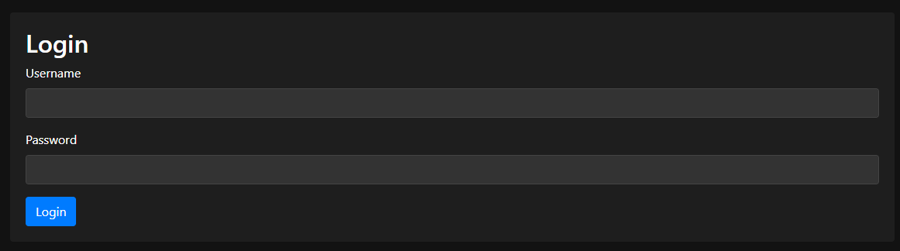

# 방구석 메이드(MaidGPT) 프로젝트

MaidGPT는 GPT를 이용하여 메이드(또는 원하는 캐릭터)를 구현하고, 캐릭터와 함께 IoT와 그와 관련된 여러 부가기능을 사용하기 쉽도록 관리 페이지와 각종 유틸들을 묶어서 제공하는 프로젝트입니다. MaidGPT의 주요 기능은 다음과 같습니다. 

MaidGPT 관리 페이지

MaidGPT가 할 수 있는 주요 기능들을 쉽게 관리 할 수 있도록 웹 페이지를 작성하였다. 

1. 테스트용 메인 웹페이지
    1. 캐릭터 메인 이미지
    2. 서버 상태, 로그 확인
    3. 채팅, 마이크 입력 테스트
2. 채팅 내역 관리와 휴먼 피드백
    1. 채팅 내역 확인
    2. 채팅 내역 평가
3. 프롬프트 관리
    1. 시스템 프롬프트
    2. 캐릭터 프롬프트
    3. 함수 프롬프트
4. 감정출력 관리
    1. 감정 분류 프롬프트
    2. 분류할 감정과 예시 목록 구성
5. Python 함수 관리
    1. 함수 목록 관리와 삭제, 저장
    2. 함수 코딩

이외에도 사용성 개선과 여러가지 기능을 계속 추가해나갈 예정이다. 

MaidGPT 메신저

본래 MaidGPT는 감정 데이터를 같이 받아 Unity3D에서 다양한 동작을 하도록 만들었으나, 배포 불가능한 VRChat 모델과 관련된 라이브러리들이 포함되어 있어 이것을 배포할 수 는 없었다. 
대신 Python으로 간단한 채팅 프로그램을 제작하여 MaidGPT의 기능을 쉽게 사용할 수 있도록 하였다. 

[방구석 메이드 메신저](https://www.notion.so/2cee834d66b04df4a374d686432c51f1?pvs=21)

MaidGPT 웹 관리 페이지에서는 여러 기능을 실행 할 수 있다. 

관리 페이지는 웹 페이지와 메이드가 실제로 GPT와 통신한 뒤 결과를 정리하고 함수를 실행하는 서버로 나뉘어 구성되어 있다. 

```jsx
python app.py
```

위 명령어로 MaidGPT 웹 서버 + MaidGPT 서버 + STT와 TTS 서버를 전부 한번에 켤 수 있다. 

MaidGPT 웹 페이지 메뉴얼



먼저 로그인 기능을 통해서 외부에서 관리 페이지를 함부로 접근 할 수 없도록 한다.

Username과 패스워드는 server_config.json 에서 설정 할 수 있다. 

Username / password 설정 방법


메인 페이지에는 캐릭터의 이미지와, 서버에 지속적으로 health_check 상태를 받아와 서버가 정상 작동하고 있는지 감지한다. 아래에는 웹페이지에서 채팅과 음성 인식을 실행해 볼 수 있도록 채팅 메뉴와 Mic버튼이 있다. 

Mic 버튼은 누르고 있는 동안 음성 녹음이 실행되며, 마이크의 음성이 입력되고 음성이 끝나고 1초가 지나면 OpenAI Whisper 모델에 음성을 전송하여 Speech-to-Text를 실행한다. 

Speech-to-Text가 실행되고 나면 그 결과 값을 받아와, 자동으로 메세지를 보낸다.


Chat History 메뉴에서는 지금까지 했던 채팅들이 저장되어 볼 수 있으며, 여기에 좋아요와 싫어요로 채팅했던 내역을 평가해 차후 데이터로 사용할 수 있게 만들었다. 평가한 채팅 내역은 chat_history.json로 폴더에 저장된다. 


Edit Prompt에서는 프롬프트를 설정 할 수 있다. 기본적인 대화의 퀄리티를 위한 시스템 프롬프트와 캐릭터의 구체적인 설정을 적는 캐릭터 프롬프트, Function Calling 용 프롬프트를 적을 수 있다.

Function Calling 용 프롬프트는 특정 명령을 내리면 특정 함수를 실행하고, 매개변수를 전달하도록 도와준다.

 


Edit Functions 화면에서는 원하는 함수를 추가 / 삭제 하도록 할 수 있다.

사용자는 원하는 함수를 추가함으로서 다양한 API를 연결하여 메이드가 여러가지 일을 할 수 있도록 커스텀 시켜줄 수 있다.  

함수를 전부 작성한 뒤에는 Save All 버튼으로 저장하고, 추가 함수가 필요하다면 Add Function을 통해 새로운 함수를 만들어 준다.  Save All 버튼을 눌러 저장한 뒤에는 Restart Server 버튼을 눌러야 서버가 재시작 되어 작성된 함수들이 적용된다. 

이 저장소에서는 Samsung SmartThings와 LG Thinq를 이용하여 여러 IoT를 사용하고 있으며, 그 예시가 되는 함수를 작성하여 포함시켜 놓았다. 

LG Thinq의 사용에는 https://github.com/majki09/domoticz_lg_thinq_plugin 저장소를 이용하였다.

함수 작성 규칙과 원리는 다음과 같다.

- 외부 모듈을 사용해야 할 경우, 다음과 같이 import를 함수 안에 작성해준다.

```
def set_acTemp(temp):
    from LGPlugin import client as LGClient
    thinqClient = LGClient.client_set()
    temp = int(temp)
    if temp < 28 and temp > 17 :
        LGClient.set_temp(thinqClient, "에어컨장비코드", temp)
        return True
    else :
        return False
```

- 함수에는 반드시 return이 존재해야 한다. 위 함수와 같이 성공/실패 여부가 있을 경우에는
return True / return False를 작성하고, 특정 값을 가져와서 전달해야 한다면, 아래와 같이 결과 값을 return 하도록 설정해주어야 한다.

```
def timeKST():
    from datetime import datetime, timedelta, timezone
    utc_now = datetime.utcnow()
    kst_timezone = timezone(timedelta(hours=9))
    kst_now = utc_now.replace(tzinfo=timezone.utc).astimezone(kst_timezone)
    return kst_now.strftime('%Y-%m-%d %H:%M:%S %Z%z')
```

- 함수를 실행하게 되면, 내부적으로는 exec를 이용하여 다음과 같이 작동된다.
입력이 주어지면, Function Calling을 통해 받은 인자로 함수를 찾아 그에 맞는 함수 코드를 작성해놓고, result = 찾은_함수_이름 의 식을 이용하여 함수를 불러온 뒤 결과를 result 에 저장한다. 
result는 다시 캐릭터의 대사와 합쳐서 다시한번 GPT에 전송되고, 함수를 실행하고 이에 맞는 응답을 다시 받아와 출력해준다.


마지막 기능으로 메이드는 답변 할 때 마다 감정 분류 함수가 실행되어, 메이드가 어떤 감정으로 답변을 하고 있는지 받아올 수 있다. Emotion Embedding 탭에서는 어떤 감정으로 어떻게 분류 할 것인지 설정 할 수 있다.  prompt를 통해 어떻게 감정을 분류할 것인지 설정하고, 아래의 표를 통하여 어떤 감정과 그 감정이 어떨 때 느끼게 할 것인지 설정할 수 있다. 

해당 기능 역시 Save를 하여 저장하고, Restart Server로 서버를 재시작해야 적용된다. 


이외의 사용에 필요한 OpenAI API나 각종 API키의 경우에는 server_config.json이나 서버코드 내부에서 설정해주어야 한다. 

STT / TTS

STT는 Openai의 whisper 모델을 이용하였으며, OpenAI API를 이용한 STT와 Local 모델을 이용한 STT 코드를 둘 다 첨부하여 서버 형태로 만들었다. **ip:6008/api/stt** 라는 API를 이용하여 STT를 이용할 수 있으며, MaidGPT의 서버에서도 해당 경로의 API를 활용하여 STT를 사용한다. 

TTS의 경우에는 https://github.com/myshell-ai/MeloTTS/를 이용하였으며, **tts_server.py**를 작성하여 **ip:6007/api/tts** 라는 API를 이용하여 TTS를 로컬 저장소에서 이용할 수 있도록 하였다. TTS의 모델을 만드는 방법에 대해서는 해당 저장소에서는 설명하지 않도록 하겠다.