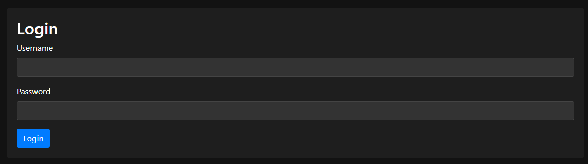

# 방구석 메이드 프로젝트 (MaidGPT) 🧹

MaidGPT는 GPT를 이용하여 메이드(또는 원하는 캐릭터)를 구현하고, 캐릭터와 함께 IoT와 그와 관련된 여러 부가기능을 사용하기 쉽도록 관리 페이지와 각종 유틸들을 묶어서 제공하는 프로젝트입니다. MaidGPT의 주요 기능은 다음과 같습니다.

## MaidGPT 관리 페이지 🛠️

MaidGPT 관리 페이지는 MaidGPT의 주요 기능들을 쉽게 관리할 수 있도록 설계되었습니다.

### 1. 테스트용 메인 웹페이지
- **캐릭터 메인 이미지**
- **서버 상태 및 로그 확인**
- **채팅 및 마이크 입력 테스트**

### 2. 채팅 내역 관리와 휴먼 피드백
- **채팅 내역 확인**
- **채팅 내역 평가**

### 3. 프롬프트 관리
- **시스템 프롬프트**
- **캐릭터 프롬프트**
- **함수 프롬프트**

### 4. 감정 출력 관리
- **감정 분류 프롬프트**
- **분류할 감정과 예시 목록 구성**

### 5. Python 함수 관리
- **함수 목록 관리 및 삭제, 저장**
- **함수 코딩**

사용성 개선과 여러 기능을 계속 추가할 예정입니다.

## MaidGPT 메신저 📲

본래 MaidGPT는 감정 데이터를 받아 Unity3D에서 다양한 동작을 하도록 만들었으나, 배포 불가능한 VRChat 모델 관련 라이브러리가 포함되어 있어 배포할 수 없었습니다. 대신 Python으로 간단한 채팅 프로그램을 제작하여 MaidGPT의 기능을 쉽게 사용할 수 있도록 하였습니다.

[방구석 메이드 메신저](https://www.notion.so/2cee834d66b04df4a374d686432c51f1?pvs=21)

MaidGPT 웹 관리 페이지에서는 여러 기능을 실행할 수 있습니다.

관리 페이지는 웹 페이지와 MaidGPT가 실제로 GPT와 통신한 뒤 결과를 정리하고 함수를 실행하는 서버로 나뉘어 구성되어 있습니다.

```bash
python app.py
```

위 명령어로 MaidGPT 웹 서버, MaidGPT 서버, STT 및 TTS 서버를 모두 한 번에 실행할 수 있습니다.

## MaidGPT 웹 페이지 메뉴얼 📘



먼저 로그인 기능을 통해 외부에서 관리 페이지를 함부로 접근할 수 없도록 합니다.

사용자 이름과 비밀번호는 \`server_config.json\`에서 설정할 수 있습니다.

### 사용자 이름/비밀번호 설정 방법


메인 페이지에는 캐릭터의 이미지와 서버의 상태를 지속적으로 확인하여 서버가 정상 작동하는지 감지합니다. 아래에는 웹페이지에서 채팅과 음성 인식을 실행할 수 있도록 채팅 메뉴와 마이크 버튼이 있습니다.

마이크 버튼을 누르고 있는 동안 음성 녹음이 실행되며, 음성이 끝나고 1초가 지나면 OpenAI Whisper 모델에 음성을 전송하여 음성을 텍스트로 변환합니다. 변환된 텍스트는 자동으로 메시지로 전송됩니다.


채팅 기록 메뉴에서는 지금까지 했던 채팅들을 저장하고 볼 수 있으며, 좋아요와 싫어요로 채팅 기록을 평가하여 차후 데이터로 사용할 수 있습니다. 평가한 채팅 기록은 \`chat_history.json\`에 저장됩니다.


프롬프트 편집 메뉴에서는 프롬프트를 설정할 수 있습니다. 기본적인 대화의 품질을 위한 시스템 프롬프트, 캐릭터의 구체적인 설정을 적는 캐릭터 프롬프트, 함수 호출용 프롬프트를 적을 수 있습니다.

함수 호출용 프롬프트는 특정 명령을 내리면 특정 함수를 실행하고, 매개변수를 전달하도록 도와줍니다.


함수 편집 화면에서는 원하는 함수를 추가/삭제할 수 있습니다.

사용자는 원하는 함수를 추가하여 다양한 API를 연결해 메이드가 여러 가지 일을 할 수 있도록 커스터마이징할 수 있습니다.

모든 함수를 작성한 후에는 Save All 버튼으로 저장하고, 새로운 함수가 필요하다면 Add Function을 통해 새로운 함수를 추가합니다. 저장 후에는 Restart Server 버튼을 눌러야 서버가 재시작되며 작성된 함수들이 적용됩니다.

이 저장소에서는 Samsung SmartThings와 LG Thinq를 이용하여 여러 IoT를 사용하고 있으며, 예시가 되는 함수를 작성하여 포함시켰습니다. LG Thinq의 사용에는 [이 저장소](https://github.com/majki09/domoticz_lg_thinq_plugin)를 이용하였습니다.

### 함수 작성 규칙과 원리
- 외부 모듈을 사용해야 할 경우, 다음과 같이 함수 안에 import를 작성합니다:

```python
def set_acTemp(temp):
    from LGPlugin import client as LGClient
    thinqClient = LGClient.client_set()
    temp = int(temp)
    if 17 < temp < 28:
        LGClient.set_temp(thinqClient, "AC_DEVICE_CODE", temp)
        return True
    else:
        return False
```

- 각 함수는 반드시 return 문이 있어야 합니다. 성공/실패 여부가 있을 경우 \`return True\` / \`return False\`를 작성하고, 특정 값을 반환해야 할 경우 다음과 같이 결과 값을 반환하도록 설정합니다:

```python
def timeKST():
    from datetime import datetime, timedelta, timezone
    utc_now = datetime.utcnow()
    kst_timezone = timezone(timedelta(hours=9))
    kst_now = utc_now.replace(tzinfo=timezone.utc).astimezone(kst_timezone)
    return kst_now.strftime('%Y-%m-%d %H:%M:%S %Z%z')
```

- 함수는 내부적으로 \`exec\`를 사용하여 실행됩니다. 입력이 주어지면 함수 호출을 통해 받은 매개변수로 함수를 찾아 코드에 맞는 함수를 작성한 뒤, \`result = 함수_이름\` 식을 이용해 함수를 호출하고 결과를 \`result\`에 저장합니다. 결과는 다시 캐릭터의 대사와 합쳐져 GPT로 전송되어 응답을 받아 출력합니다.


마지막으로 메이드는 답변할 때마다 감정 분류 함수가 실행되어 메이드가 어떤 감정으로 답변하는지 받아올 수 있습니다. Emotion Embedding 탭에서는 감정을 어떻게 분류할지 프롬프트를 통해 설정하고, 아래 표를 통해 어떤 감정과 그 감정이 어떨 때 느끼게 하는지 설정할 수 있습니다.

해당 기능 역시 Save 버튼을 눌러 저장하고, Restart Server로 서버를 재시작해야 적용됩니다.


OpenAI API나 기타 필요한 API 키는 \`server_config.json\`이나 서버 코드 내부에서 설정해야 합니다.

## STT/TTS 🎙️
- **STT**: OpenAI의 Whisper 모델을 사용하여 API와 로컬 모델 STT 서버 코드를 제공합니다. **ip:6008/api/stt** API를 이용해 STT를 사용할 수 있습니다.
- **TTS**: [MeloTTS](https://github.com/myshell-ai/MeloTTS/)를 사용하였으며, \`tts_server.py\`를 작성하여 **ip:6007/api/tts** API를 통해 로컬 TTS를 사용할 수 있도록 하였습니다.

TTS 모델 생성 방법은 MeloTTS 저장소를 참조하십시오.

---

이 마크다운 문서는 정확하게 번역되었으며, 읽기 쉽게 이모지와 포맷팅을 추가했습니다.
